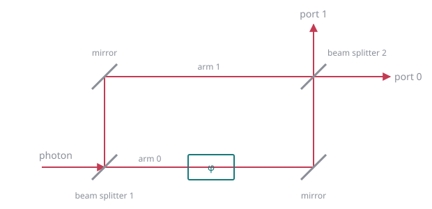

# Working in `notebooks/`

Pedagogy rules are binding and live in `plans/master-plan.md` → "Audience and pedagogy"
(~60% markdown, concept before code, every QM term introduced at first use). This file
covers only the mechanics, which are easy to get wrong.

## Building a notebook

- **Never hand-write `.ipynb` JSON.** Write a Python script (in the scratchpad, not the
  repo) that builds the notebook with `nbformat`, and run it.
- Run `nbformat.validator.normalize()` before writing, or cells ship without an `id`
  field and `nbformat.validate` warns.
- **Ship with no stored outputs**: empty `outputs`, `execution_count: null`.

## Diagrams

**Never draw apparatus with ASCII art.** It misaligns the moment the font or cell width
changes — the first version of notebook 05's interferometer was already broken on the day
it was written. Commit an SVG to `notebooks/figures/` instead and reference it from a
markdown cell with a relative path:

```markdown

```

That renders in JupyterLab *and* on GitHub, needs no execution, and diffs as text. Write a
real `<title>` and `<desc>`, and a descriptive alt text — these are teaching materials.

Colours must work on both light and dark backgrounds, since an `` cannot inherit the
page's theme: mid-grey `#8a8f98` for apparatus, `#c33b53` for beams and light paths,
`#17797c` for detectors and annotations. No white fills.

Check the result rather than assuming: render the SVGs on a light *and* a dark background
and look at them. Overlapping labels are the normal failure mode.

## Gotchas that have already bitten

- **A `|` inside `$…$` inside a markdown table silently destroys the table.** The table
  parser splits on it before MathJax ever sees it, so `| $|0\rangle$ |` becomes two cells
  and the whole row collapses. Kets are everywhere here, so write `\lvert 0\rangle` — it
  is unambiguous LaTeX and contains no pipe at all. (`\|` also survives the parser, but it
  means ‖ in LaTeX, so it only works by accident.) Four tables shipped broken this way.
- **`ruff check .` lints notebooks.** Cells need no unused imports and must stay under
  100 columns, same as `src/`. Import only the gates a notebook actually uses.
- **Assign the figure**: `fig = viz.amplitudes(qc)`, not a bare `viz.amplitudes(qc)`.
  Every `viz` function returns its `Figure`, and a bare call renders twice — once from
  the inline backend and once as the cell result.
- **Seeds from `range(n)` are fine** — NumPy's `SeedSequence` makes consecutive seeds give
  independent streams (verified over 200,000 of them). But a demo whose *narrative* depends
  on a particular outcome ("notice the count is near 500") should use enough samples that
  the claim holds for any seed block, since 400 fair coin flips land anywhere in ~180–220.
- Verify every prose claim by running the snippet first. If the library disagrees with
  the markdown, fix the markdown — or report a real library bug, never paper over one.

## The API as taught

`a, b = qc.alloc_many(2)` (not `Circuit(2)`), angles are keyword-only
(`Rz(a, theta=…)`), subsets are lists of qubit **handles** (`entanglement_entropy([a])`,
never `[0]`), and `reg[0]` is the most significant bit. Gates have long aliases —
`Hadamard is H` — usable wherever they read better.

## Gate

`uv run jupyter execute notebooks/*.ipynb` must succeed. It is part of every phase's
definition of done.
